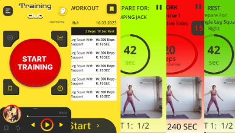
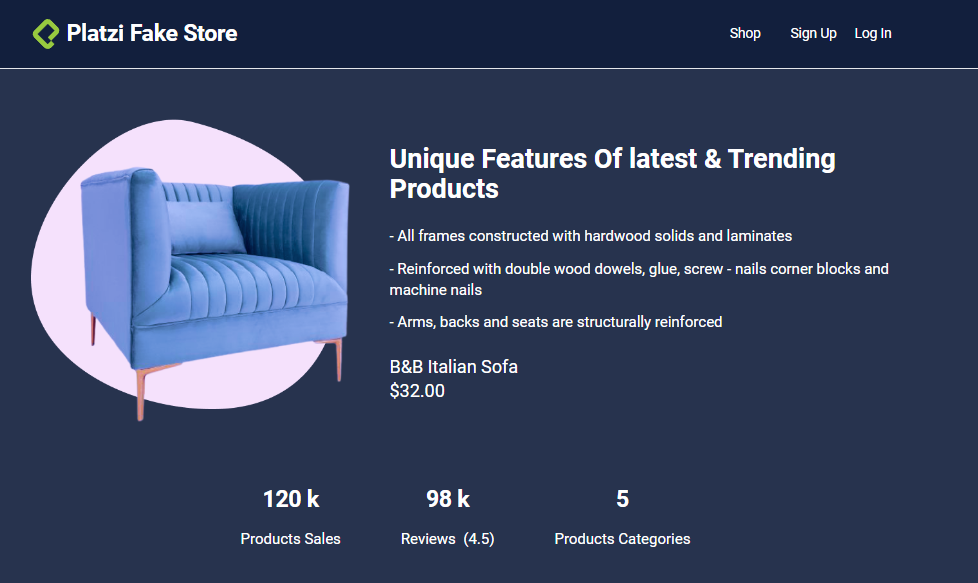
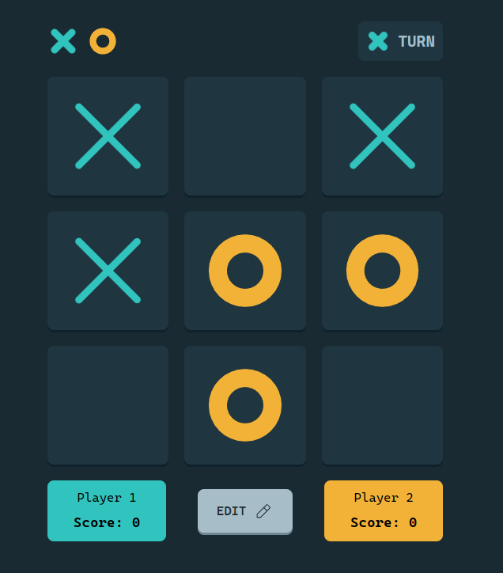
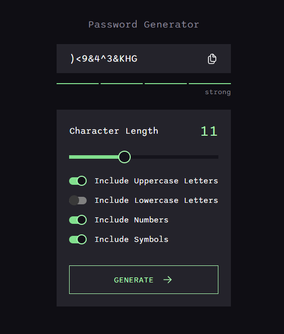

<h1 align='center'>👋 Hi there! I'm Bohdan - Front-end developer</h1>
 

  My name is Bohdan, I am a 2nd year student of National Aerospace 
  University - Kharkiv Aviation Institute.
  My goal is to work and develop in the field of front-end development, so I 
  am constantly learning new technologies and development methods in 
  order to create better code and improve user experience.
  I am very motivated and ready to work hard to improve my skills and 
  learn new technologies in front-end development.

 
<h2 align='center'>💻 My technical stack</h2>
<h3 align='center'>Front-end</h3>
<table align="center">
  <tr>
    <td align="center" height="70" width="70">
      
       HTML5
    </td>
    <td align="center" height="70" width="70">
      
       CSS3
    </td>
    <td align="center" height="70" width="70">
      
       SASS
    </td>
    <td align="center" height="70" width="70">
      
       JavaScript
    </td>
    <td align="center" height="70" width="70">
      
       TypeScript
    </td>
    <td align="center" height="70" width="70">
      
       React
    </td>
  </tr>
  <tr>
    <td align="center" height="70" width="70">
      
       Next.js
    </td>
    <td align="center" height="70" width="70">
      
       React Native
    </td>
    <td align="center" height="70" width="70">
      
       Redux
    </td>
    <td align="center" height="70" width="70">
      
       Styled Components
    </td>
  </tr>
</table>
<h3 align='center'>Beck-end</h3>
<table align="center">
  <tr>
    <td align="center" height="70" width="70">
      
       Node.js
    </td>
    <td align="center" height="70" width="70">
      
       Express.js
    </td>
    <td align="center" height="70" width="70">
      
       MongoDB
    </td>
  </tr>
</table>
 
<h2 align="center">Projects</h2>
<table>
<tr style="display: flex;">
    <td width='50%'>
      <h2 align='center'>Training Club</h2>
      
  
        
         
         
        

          
            
        

        
<strong><i>Fron-end: </i> TypeScript, React, Material UI, React Query, React Hook Form </strong>

        
<strong><i>Back-end: </i> Node.js, Express, Mongodb, Mongoose, TypeScript, Firebase, AWS </strong>

      

    </td>
      <td  width='50%'>
      <h2 align='center'>Platzi Fake Store</h2>
      
  
        
         
         
        

          
            
        

        
<strong><i>Front-end: </i>React, TypeScript, Redux, TailwindCSS, Firebase</strong>

         
         
           
      

    </td>
  </tr>
  <tr style="display: flex;">
    <td width='50%'>
      <h2 align='center'>Mortal Kombat API</h2>
      
  
        
         
         
        

          
        

        
<strong><i>Back-end: </i>Node.js, Express.js, MongoDB, Mongoose, TypeScript</strong>

      

    </td>
    <td width='50%'>
      <h2 align='center'>Tic Tac Toe</h2>
      
  
        
         
         
        

          
            
        

        
<strong><i>Front-end: </i>React, Redux, TypeScript, TailwindCSS</strong>

      

    </td>
  </tr>
  <tr style="display: flex;">
    <td width='50%'>
      <h2 align='center'>Password Generator</h2>
      
  
        
         
         
        

          
            
        

        
<strong><i>Front-end: </i> TypeScript, React, Redux, CSS Modules </strong>

      

    </td>
  </tr>
</table>
